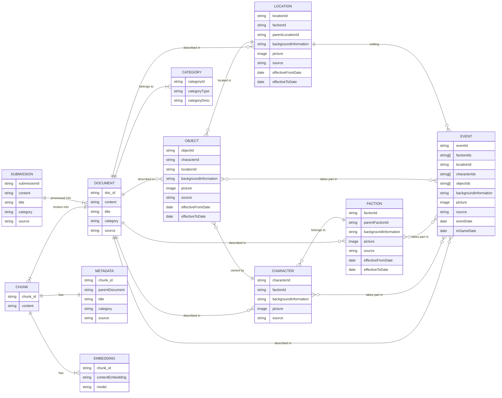

# Data Model for the Site

```mermaid
erDiagram
    direction LR
    CHUNK }|--|| DOCUMENT : "broken into"
    DOCUMENT ||--o{ CHARACTER : "described in"
    DOCUMENT ||--o{ FACTION : "described in"
    DOCUMENT ||--o{ LOCATION : "described in"
    DOCUMENT ||--o{ EVENT : "described in"
    DOCUMENT ||--o{ OBJECT : "described in"
    CHUNK ||--|| METADATA : "has"
    CHUNK ||--|{ EMBEDDING : "has"
    DOCUMENT ||--|{ CATEGORY : "belongs to"
    SUBMISSION ||--|{ DOCUMENT : "processed into"
    CHARACTER }o--o{ EVENT : "takes part in"
    CHARACTER }o--|| FACTION : "belongs to"
    FACTION }o--o{ EVENT : "takes part in"
    OBJECT }o--o{ EVENT : "takes part in"
    LOCATION ||--o{ EVENT : "setting"
    OBJECT }o--|| CHARACTER : "owned by"
    OBJECT }o--|| LOCATION : "located in"

CHUNK {
    string chunk_id
    string content
}

METADATA {
    string chunk_id
    string parentDocument
    string title
    string category
    string source
}

EMBEDDING {
    string chunk_id
    string contentEmbedding
    string model
}

DOCUMENT {
    string doc_id
    string content
    string title
    string category
    string source
}

SUBMISSION {
    string submissionId
    string content
    string title
    string category
    string source
}

CATEGORY {
    string categoryId
    string categoryType
    string categoryDesc
}

CHARACTER {
    string characterId
    string factionId
    string backgroundInformation
    image picture
    string source
}

FACTION {
    string factionId
    string parentFactionId
    string backgroundInformation
    image picture
    string source
    date effectiveFromDate
    date effectiveToDate
}

LOCATION {
    string locationId
    string factionId
    string parentLocationId
    string backgroundInformation
    image picture
    string source
    date effectiveFromDate
    date effectiveToDate
}

OBJECT {
    string objectId
    string characterId
    string locationId
    string backgroundInformation
    image picture
    string source
    date effectiveFromDate
    date effectiveToDate
}

EVENT {
    string eventId
    string[] factionIds
    string locationId
    string[] characterIds
    string[] objectIds
    string backgroundInformation
    image picture
    string source
    date eventDate
    date inGameDate
}

```